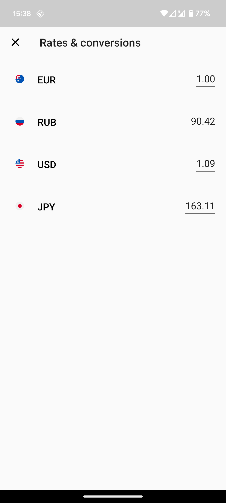

💱 KMP Currency Exchange App
A Kotlin Multiplatform (KMP) showcase application that fetches currency exchange rates from https://exchangeratesapi.io and calculates exchange rates based on a selected currency.

<p align="center">  </p>

🧱 Tech Stack

- Kotlin Multiplatform Mobile (KMM) - Android & iOS
- Ktor
- Kotlin Coroutines + Flow
- Koin
- Clean Architecture
- MVVM

🚀 Getting Started

Prerequisites
- Android Studio Giraffe or higher with KMP plugin support
- Xcode 14+ for iOS builds
- Access token from https://exchangeratesapi.io

Setup
1. Clone the repo:
`git clone git@github.com:mamykin-andrey/exChange.git && cd exChange`
2. Add your API key to a local config file or as an environment variable.
3. Run the app:
3.1 Android: Open the project in Android Studio and run on an emulator or device.
3.2 iOS: Open the iosApp folder with Xcode and run on a simulator or device.

🧪 Architecture Overview

```
|- androidApp
|- iosApp
|- shared
|--- data             # Data sources, API, DTOs
|--- domain           # Use cases, domain models
|--- presentation     # ViewModels, UI states
|--- di               # Dependency injection setup (Koin)
```
