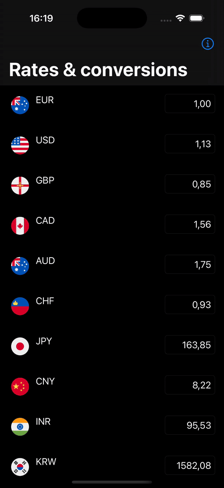
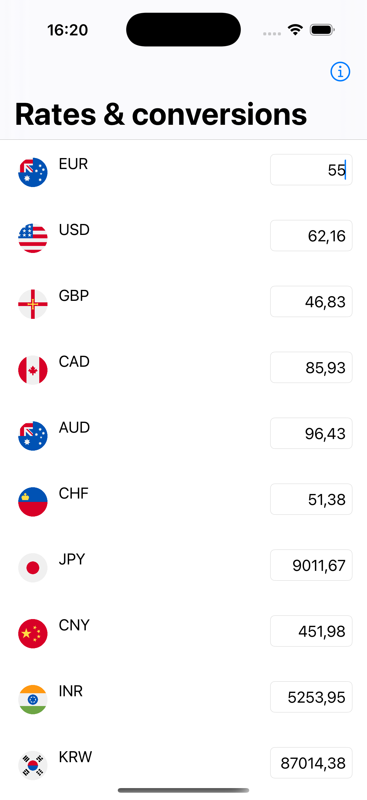

💱 KMP Currency Exchange App
A Kotlin Multiplatform (KMP) showcase application that fetches currency exchange rates from https://exchangeratesapi.io and calculates exchange rates based on a selected currency. Supports dark theme and simple navigation on both platforms.

| UX | Android dark | Android light | iOS dark | iOS light |
|---|---|---|---|---|
|  |  |  |  |  |

🧱 Tech Stack

- Kotlin Multiplatform Mobile (KMM) - Android & iOS
- Ktor
- Kotlin Coroutines + Flow
- Koin
- Clean Architecture + MVVM
- Swift UI (iOS) + Jetpack Compose (Android)

🚀 Getting Started

Prerequisites
- Android Studio Giraffe or higher with KMP plugin support
- Xcode 14+ for iOS builds
- Access token from https://exchangeratesapi.io

Setup
1. Clone the repo:
   `git clone git@github.com:mamykin-andrey/exChange-kmp.git && cd exChange`
2. Add your API key to local.properties as `exchangeapikey=YOUR_KEY`
3. Run the app:
   1. **Android:** Open the project in Android Studio and run on an emulator or device.
   2. **iOS:** Open the iosApp folder with Xcode and run on a simulator or device. **Note:** to run iOS you have to build the iOSApp target in Android Studio first

🧪 Architecture Overview

```
|- androidApp
|--- Jetpack Compose code
|- iosApp
|--- Swift UI code
|- shared
|--- data             # Data sources, API, DTOs
|--- domain           # Use cases, domain models
|--- presentation     # ViewModels, UI states
|--- di               # Dependency injection
```
